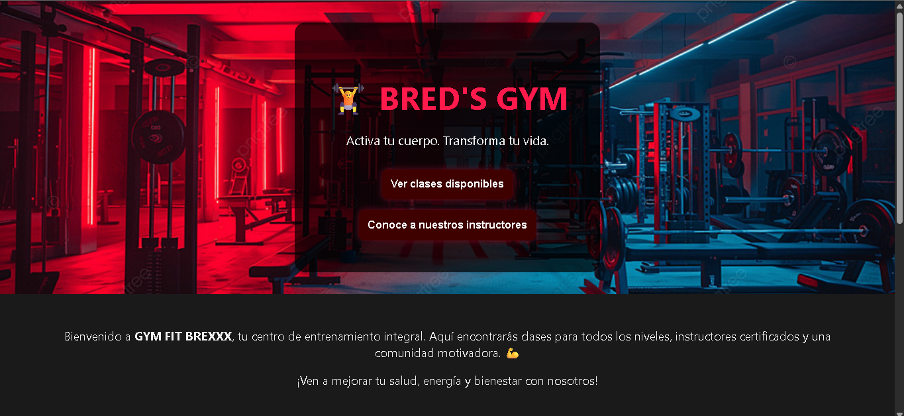

# Sistema Web BREDS-GYM

Este es un sistema web completo para la gestión de un gimnasio, llamado BREDS-GYM. La aplicación permite a los usuarios registrarse, iniciar sesión, ver clases, inscribirse en ellas y ver las rutinas de entrenamiento.



## Tecnologías Utilizadas

### Frontend
- **React**: Una biblioteca de JavaScript para construir interfaces de usuario.
- **Vite**: Una herramienta de compilación rápida para el desarrollo web moderno.
- **React Router**: Para la navegación y el enrutamiento dentro de la aplicación.
- **Axios**: Para realizar solicitudes HTTP al backend.
- **React Icons**: Para el uso de iconos en la interfaz.

### Backend
- **Node.js**: Un entorno de ejecución de JavaScript del lado del servidor.
- **Express**: Un framework de aplicación web para Node.js.
- **MySQL2**: Un cliente de MySQL para Node.js.
- **bcrypt**: Para el hash y la seguridad de las contraseñas.
- **CORS**: Para habilitar las solicitudes de recursos de origen cruzado.
- **Nodemon**: Para el desarrollo, reinicia automáticamente el servidor cuando se detectan cambios en los archivos.

### Base de Datos
- **MySQL**: El sistema de gestión de bases de datos relacionales utilizado para almacenar los datos de la aplicación. Los scripts de la base de datos se encuentran en el directorio `Base de Datos` y están separados en:
    - `gym_app_usuarios.sql`: Para la tabla de usuarios.
    - `gym_app_inscripciones.sql`: Para la tabla de inscripciones a clases.
    - `gym_app_routines.sql`: Para la tabla de rutinas.

## Instalación y Configuración

### Prerrequisitos
- Node.js y npm (o yarn)
- MySQL

### Backend
1. Navega al directorio `Backend`:
   ```sh
   cd Backend
   ```
2. Instala las dependencias:
   ```sh
   npm install
   ```
3. Inicia el servidor de desarrollo:
   ```sh
   npm run dev
   ```
El servidor se ejecutará en `http://localhost:3001` (o el puerto que hayas configurado).

### Frontend
1. Navega al directorio `Frontend`:
   ```sh
   cd Frontend
   ```
2. Instala las dependencias:
   ```sh
   npm install
   ```
3. Inicia la aplicación de desarrollo:
   ```sh
   npm run dev
   ```
La aplicación se abrirá en `http://localhost:5173` (o el puerto que Vite asigne).

### Base de Datos
1. Asegúrate de que tu servidor MySQL esté en funcionamiento.
2. Crea una nueva base de datos en MySQL.
3. Importa los archivos `.sql` del directorio `Base de Datos` en tu base de datos. Puedes importarlos en el siguiente orden:
   - `gym_app_usuarios.sql`
   - `gym_app_routines.sql`
   - `gym_app_inscripciones.sql`
4. Asegúrate de que la configuración de la conexión a la base de datos en el archivo `Backend/Index.js` (o donde esté configurada la conexión) coincida con tus credenciales de MySQL.

## Scripts Disponibles

### Backend
- `npm run dev`: Inicia el servidor de backend en modo de desarrollo con nodemon.

### Frontend
- `npm run dev`: Inicia el servidor de desarrollo de Vite.
- `npm run build`: Compila la aplicación de React para producción.
- `npm run lint`: Ejecuta el linter de ESLint para revisar el código.
- `npm run preview`: Sirve la compilación de producción localmente para previsualizarla.
